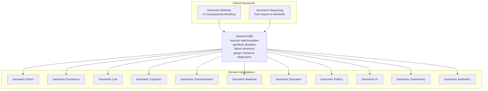

# Geometric Reasoning: From Search to Manifolds

**Andrew H. Bond**
Senior Member, IEEE | San Jose State University

---

## Part of the Geometric Series

*Geometric Reasoning* is Volume 3 of the Geometric Series. With *Geometric
Methods*, it forms the general framework that the domain volumes instantiate:

- **Geometric Methods: Computational Modeling** (Bond, 2026a) — the mathematical toolkit
- **Geometric Ethics: The Mathematical Structure of Moral Reasoning** (Bond, 2026b) — the toolkit applied to moral reasoning

This book generalizes that work to *all* reasoning, treating moral reasoning as
a special case. Reasoning is modeled as informed search on a Riemannian
"reasoning manifold": optimal reasoning is a geodesic, a heuristic field is what
navigates it, and characteristic failures — framing effects, sycophancy,
anchoring, miscalibration — are geometrically characterizable deviations,
measured empirically across frontier language models in the *Measuring AGI*
program.

## Status

Draft complete. See the `manuscript/` directory for the current draft.

## Series map

## The Geometric Series

| Book | Status |
|------|--------|
| [Geometric Methods: Computational Modeling](https://github.com/ahb-sjsu/geometric-methods) | Published |
| [Geometric Ethics: The Mathematical Structure of Moral Reasoning](https://github.com/ahb-sjsu/geometric-ethics) | Published (v1.23) |
| **Geometric Reasoning: From Search to Manifolds** | **Draft complete** |
| [Geometric Economics: Decision Manifolds, the Bond Geodesic Equilibrium, and the Irrecoverable Geometry of Markets](https://github.com/ahb-sjsu/geometric-economics) | Draft |
| [Geometric Law: Symmetry, Invariance, and the Structure of Legal Reasoning](https://github.com/ahb-sjsu/geometric-law) | Draft |
| [Geometric Cognition: The Mathematical Structure of Human and Artificial Thought](https://github.com/ahb-sjsu/geometric-cognition) | Draft |
| [Geometric Communication: Signal, Symmetry, and the Geometry of Meaning](https://github.com/ahb-sjsu/geometric-communication) | Draft |
| [Geometric Medicine: Clinical Reasoning, Allocation, and the Mathematics of Moral Injury](https://github.com/ahb-sjsu/geometric-medicine) | Draft |
| [Geometric Education: Learning, Assessment, and the Topology of Understanding](https://github.com/ahb-sjsu/geometric-education) | Draft |
| [Geometric Politics: Representation, Polarization, and the Topology of Democratic Choice](https://github.com/ahb-sjsu/geometric-politics) | Draft |
| [Geometric AI: Alignment, Safety, and the Manifold Structure of Machine Values](https://github.com/ahb-sjsu/geometric-ai) | Draft |
| [Geometric Gastronomy: The Mathematical Structure of Flavor, Pairing, Cooking, and Culinary Navigation](https://github.com/ahb-sjsu/geometric-gastronomy) | Draft |
| [Geometric Aesthetics: The Mathematical Structure of Judgment](https://github.com/ahb-sjsu/geometric-aesthetics) | Draft |

## License

MIT
